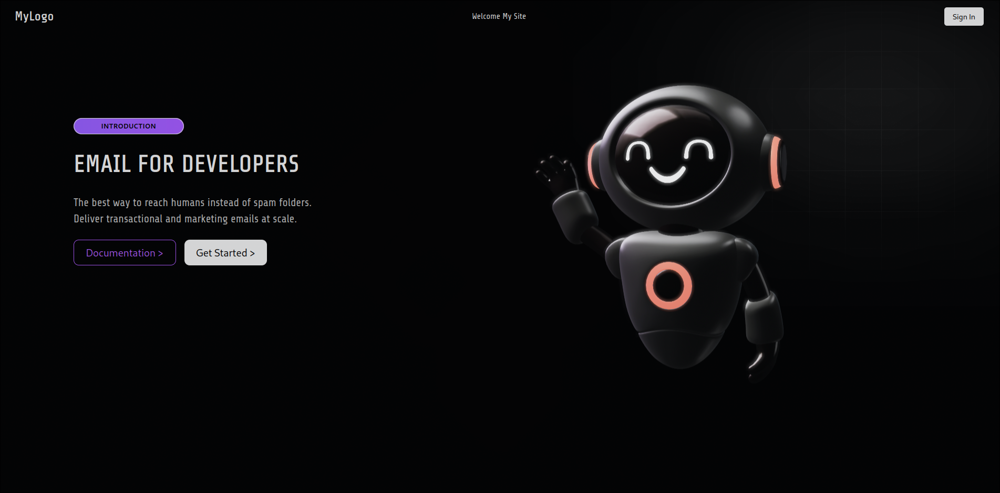

# SplineTest

Welcome to **SplineTest** — a dope project showcasing cool 3D spline animations and interactive web elements.



---

## About

This repo hosts my personal project to experiment with spline-based 3D animations and interactive UI components. Built with love and mad coding skills, it’s all about blending creative visuals with smooth user experience.

---

## Features

- Interactive 3D spline animations  
- Responsive design  
- Clean and modern UI  
- Lightweight and performant  

---

## Tech Stack

- **JavaScript / TypeScript** (whatever you’re rocking)  
- **Three.js / Spline** (for the 3D magic)  
- HTML5 & CSS3  

---

## How to Run

1. Clone this repo  
   ```bash
   git clone https://github.com/UjjwalOnGit/SplineTest.git
